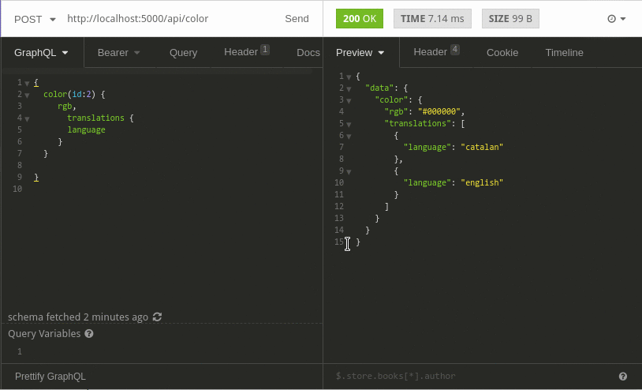
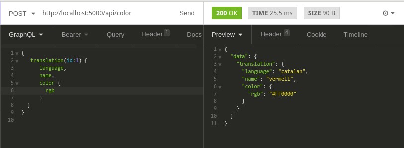
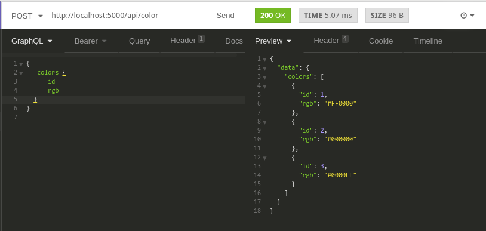
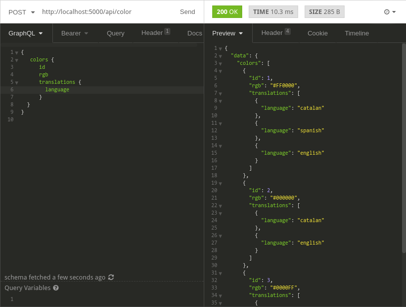
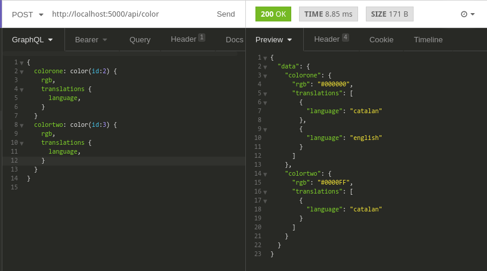
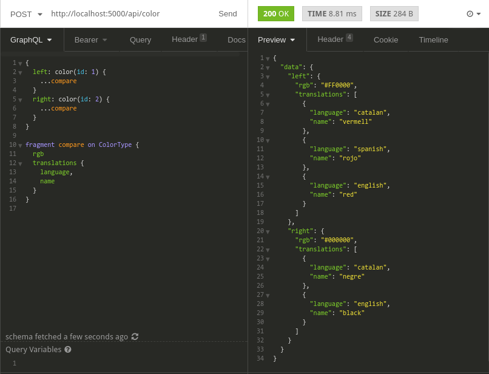
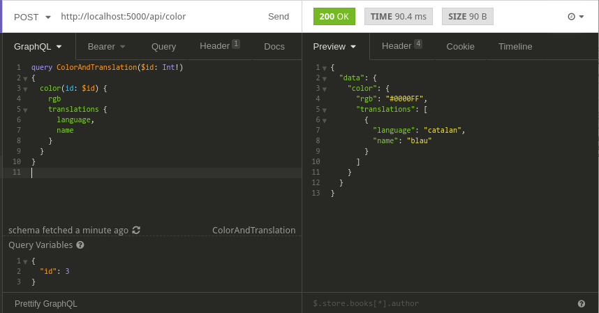
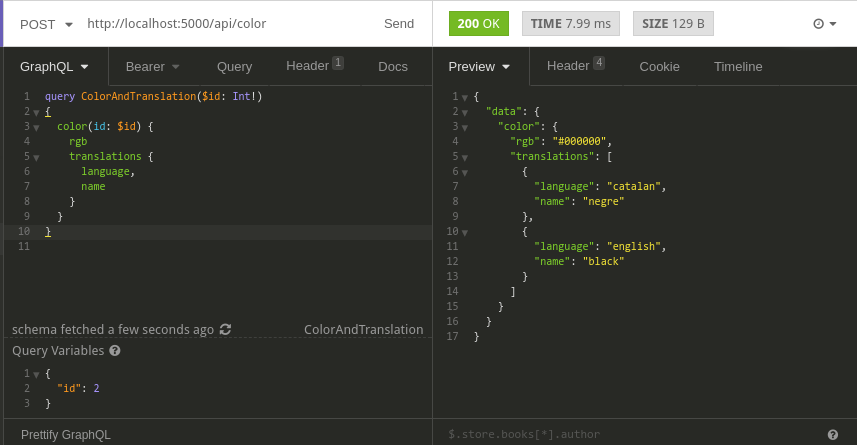
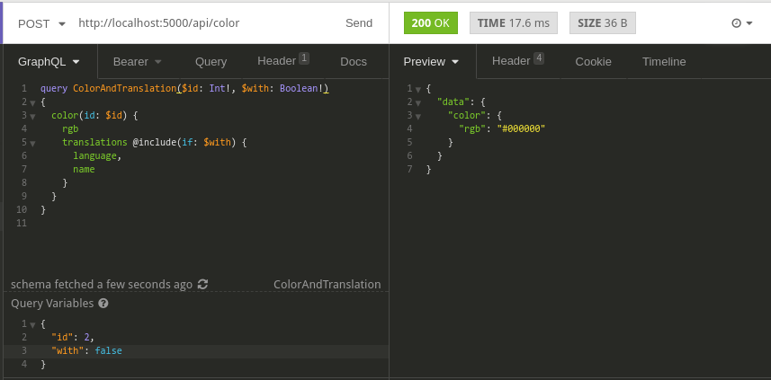

# Colors GraphQL API

Implementació de GraphQL per una API de traducció de colors. Si s'envia la petició amb "color", es poden extreure totes les dades que calguin d'un color: RGB, Traduccions, etc...

També es pot veure una traducció individualment si la petició té d'arrel "translation" i li passem l'id

I es poden llistar tots els colors de la base de dades amb l'arrel "colors":

Evidentment es poden recuperar les dades que calguin de cada color només especificant-les en la petició:

## Alies

Es poden obtenir diversos elements del servei fent servir àlies (bàsicament per evitar que hi hagi repeticions en els camps)

## Fragments

També és pot obtenir el mateix evitant repetir les dades amb els fragments

## Variables

Es poden fer servir variables per reaprofitar les peticions que s'han fet i només especificar el que canvia

## Directives

En GraphQL hi ha una sèrie de directives per control·lar el funcionament. Per exemple `@include` permet definir si una part ha de sortir o no

